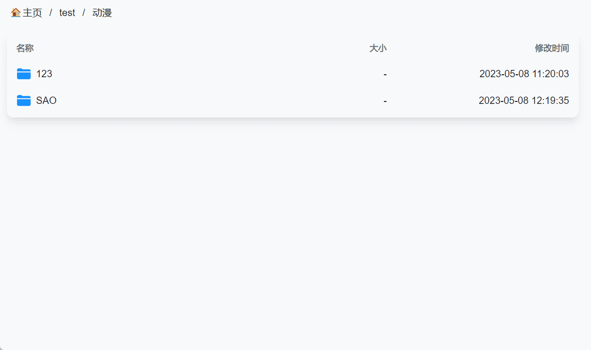

从 The Movie Database(TMDB) 获取剧集/电影信息，并对 Alist 指定媒体文件重命名，便于播放器刮削识别剧集/电影。测试Kodi, Nplayer, Infuse均可正确识别媒体信息。




## ToDo

- [x] 重命名异步操作，速度极快
- [x] 自动通过 Alist 2FA 验证
- [x] 支持电影/剧集文件重命名
- [x] 根据关键字/TMDB ID 搜索媒体信息
- [x] 从指定季数、指定集数开始重命名文件
- [x] 自动排除已重命名成功的文件
- [x] 指定文件重命名格式


## 下载安装

**环境要求**

Python(>=3.9)，建议使用 3.12 版本，已在 Windwos 11/Linux 测试通过。

**使用`pip`安装**

```shell
# 从 PyPI 安装包
pip install AlistMediaRename
# 从 PyPI 升级包
pip install --upgrade AlistMediaRename
```

**使用`pipx`安装 （推荐）**

https://pipx.pypa.io/stable/installation/

```shell
# 请确保已安装 pipx
# pipx 可以隔离安装，不对全局 Python 造成污染
# 使用 pipx 安装
pipx install AlistMediaRename
# 使用 pipx 更新
pipx upgrade AlistMediaRename
```

**使用`uv`安装 （推荐）**

https://docs.astral.sh/uv/
```shell
# 请确保已安装 uv
# uv 可以隔离安装，不对全局 Python 造成污染
# 使用 pipx 安装
uv tool install AlistMediaRename
# 使用 pipx 更新
uv tool upgrade AlistMediaRename
```

**本地运行**

```shell
# clone 项目
git clone https://github.com/jkoor/Alist-Media-Rename.git
# 进入目录
cd Alist-Media-Rename
# 安装依赖
pip install .
```

**二进制文件**

使用打包后的程序，不依赖 Python 环境，可能会存在一些问题，不建议作为首选项。
前往 [Github Action](https://github.com/jkoor/Alist-Media-Rename/actions/workflows/python-app.yml) 下载自动构建的二进制文件
```shell
# Windows 环境
.\amr.exe -h
# Linux 环境
chmod +x amr
./amr -h
```

## 快速开始

**获取 TMDb API 密钥**

首次运行会要去输入 TMDB API 密钥， 用于获取 TMDB 电影/剧集信息，可前往 [TMDB 开发者网站](https://www.themoviedb.org/settings/api)免费申请。

**Alist 2FA 验证（未开启可跳过）**

若用户开启了 Alist 2FA 验证功能，则需要提供验证密钥（非6位验证码），可通过保存验证码的对应 APP 获取，或者扫描初次绑定的二维码，可获取一串代码，最后的 sercet 字段即为 base64 密钥，格式为一串包含数字和字母的长字段，如：`2ELR4M···KVH563X`

**基本命令**

初始使用请按提示输入 Alist 网址、账号、密码、2FA 密钥以及 TMDB API 密钥，配置信息会保存在同目录下`config.yaml`文件中。

```shell
# 根据剧集关键字获取剧集信息，并输出信息
amr [剧集关键字]

# 根据剧集id精确获取剧集信息，并输出信息
amr [剧集id] -i

# 若要获取电影信息，请加上 -m 参数
amr [电影关键字] -m
amr [电影id] -d -m -i

# 根据剧集关键字获取剧集信息，并对指定文件夹中的媒体文件重命名
amr [剧集关键字] -d [Alist 文件夹路径]

# 根据剧集id精确获取剧集信息，并对指定文件夹中的媒体文件重命名
amr [剧集id] -d [Alist 文件夹路径] -i

# 若要对电影文件进行重命名，请加上 -m 参数
amr [电影关键字] -d [Alist 文件夹路径] -m
amr [电影id] -d [Alist 文件夹路径] -m -i

# 若 Alist 指定文件夹设有访问密码，请加上 -p [password] 参数
amr [剧集关键字] -d [Alist 文件夹路径] -p [路径访问密码]

# 指定剧集集号重命名，请加上 -n [number] 参数，【-】 代表连续，【,】代表多集
amr [剧集关键字] -d [Alist 文件夹路径] -n [集号]
# 只对第1集重命名
amr [剧集关键字] -d [Alist 文件夹路径] -n 1
# 从第1集开始重命名
amr [剧集关键字] -d [Alist 文件夹路径] -n 1-
# 对第1,2,3,4集开始重命名
amr [剧集关键字] -d [Alist 文件夹路径] -n 1-4
# 对第2,3集开始重命名
amr [剧集关键字] -d [Alist 文件夹路径] -n 2,3
# 对第1,3,4,5,7,10-最后一集进行重命名
amr [剧集关键字] -d [Alist 文件夹路径] -n 1,3-5,7,10-

# 获取完整使用帮助信息
amr -h
```

**举个例子**

TMDB 的剧集/电影 id 为对应网址中的数字，如剧集[《刀剑神域》](https://www.themoviedb.org/tv/45782)的 id 为 45782，电影《[刀剑神域：序列之争](https://www.themoviedb.org/movie/413594)》的 id 为 413594

剧集《刀剑神域》的视频及字幕文件在 Alist 网盘中路径为：*/阿里云盘/动漫/SAO/*

文件重命名前后对比：*1.mp4 -> 刀剑神域-S01E01.剑的世界.mp4*

```shell

# 通过关键字获取剧集信息，并重命名文件
amr 刀剑神域 -d /阿里云盘/动漫/SAO

# 通过剧集 id 获取剧集信息，并重命名文件，文件访问密码为123
amr -i 45782 -d /阿里云盘/动漫/SAO -p 123
```

电影《刀剑神域：序列之争》的视频及字幕文件在 Alist 网盘中路径为：*/阿里云盘/电影/SAO*

```shell
# 通过关键字获取电影信息，并重命名文件
amr -m 刀剑神域 -d /阿里云盘/电影/SAO

# 通过电影 id 获取电影信息，并重命名文件，文件访问密码为123
amr -m -i 413594 -d /阿里云盘/电影/SAO -p 123
```


## 配置说明

**运行参数**

| 参数           | 必填 |      默认       | 说明                           |
| -------------- | :--: | :-------------: | ------------------------------ |
| keyword        |  ☑   |                 | TMDB 搜索字段                  |
| -d             |      |                 | Alist 文件夹路径               |
| --folder / --no-folder |  |  | 是否对父文件夹进行重命名 |
| -i, --id       |      |                 | 根据 TMDB id 获取剧集/电影信息 |
| -m, --movie    |      |                 | 查找电影信息，而不是剧集       |
| -p, --password |      |     *None*      | Alist 文件夹访问密码           |
| -n, --number   |      |                 | 指定集号进行重命名           |
| -c, --config   |      | ./*config.yaml* | 指定配置文件路径               |
| --suffix       |      |                 | 为重命名文件添加自定义后缀名          |
| -h, --help     |      |                 | 显示使用帮助信息               |
| -v, --version  |      |                 | 显示版本信息                   |
| --verbose | | | 显示详细输出日志 |
| --log-file | | | 输出日志文件路径 |


**配置文件**

配置文件`config.yaml`默认保存在当前运行目录中，除基本的登录参数外，还包含几个可配置项，根据注释修改即可。

参考 [default.yaml](https://github.com/jkoor/Alist-Media-Rename/blob/main/src/AlistMediaRename/default.yaml)


## 模块使用

若需要在其他 Python 文件中调用本模块，可参考以下内容：

在`AlistMediaRename`库定义了一个类Amr()，根据代码注释要求传入相关参数，即可调用本程序的主函数

```python
from AlistMediaRename import Amr, Config

# 第一种实例化方法，定义一个配置项
config = Config()
config.alist.url = "xxx"
config.alist.user = "xxx"
config.alist.password = "xxx"
config.alist.totp = "xxx"
config.tmdb.api_key = "xxx"
config.save("./config.yaml") # 保存配置到文件
config.load("./config.yaml") # 从文件中读取配置
amr = Amr(config)
# 第二种实例化方法，从文件中读取配置
amr = Amr("./config.yaml") # 从文件中读取配置，文件不存在则会自动创建

# 根据电影id获取TMDB信息，并重命名‘dir’指定路径文件
amr.movie_rename_id('keyword', 'dir', 'password')
# 根据电影关键词获取TMDB信息，并重命名‘dir’指定路径文件
amr.movie_rename_keyword('keyword', 'dir', 'password')
# 根据剧集id获取TMDB信息，并重命名‘dir’指定路径文件
amr.tv_rename_id('keyword', 'dir', 'password')
# 根据剧集关键词获取TMDB信息，并重命名‘dir’指定路径文件
amr.tv_rename_keyword('keyword', 'dir', 'password')

```


## 最后

- 本项目是受到了 GitHub 中一个获取TMDB信息并对本地文件重命名项目的启发：[wklchris/Media-Renamer](https://github.com/wklchris/Media-Renamer)

- TMDB API 在短时间内频繁使用会限制使用，如出现此情况请稍后再试

- 欢迎邮件联系，一起交流探讨：oharcy@outlook.com

- 本程序使用 TMDB API，但未经 TMDB 认可或认证。

  
